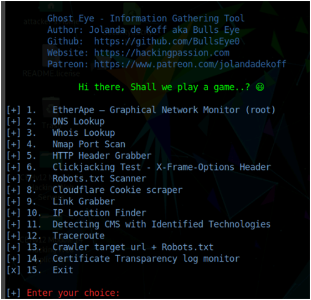

# DHCP Starvation

In a DHCP starvation attack, an attacker floods the DHCP server by sending a large number of DHCP requests and users all available IP Addresses that the HDCP server can issue. As a result, the server cannot issue any more IP addresses, leading to a Denial of Service (DoS) attack. Because of this issue, valid users cannot obtain or renew their IP addresses, and thus fail to access their network. This attack can be performed by using various tools such as **Yersinia** and **Hyenae**.

***

## Yersinia

**Yersinia** is a network tool designed to take advantage of weaknesses in different network protocols such as DHCP. It pretends to be a solid framework for analyzing and testing the deployed networks and systems.

### Open Yersinia in interactive mode

```
yersinia -I
```

### Basic command interface

```
h         # press h for help
q         # press q to exit the help options
F2        # select DHCP mode 
x         # list available attack options
```

### PoC

#### Set up a network listener using Wireshark

#### Start a DHCP Starvation attack

Press `1` to start a DHCP Starvation attack

<figure><figcaption></figcaption></figure>

now Yersinia start sending DHCP packets to the network adapter and all active machines in the local network. After some time, press `q` to stop the attack and terminate **Yersinia**. Switch to **Wireshark** and observe the huge number of captured DHCP packets.

Click on any DHCP packet and expand the **Ethernet II** node in the packet details section. Information regarding the source and destination MAC addresses is displayed.
